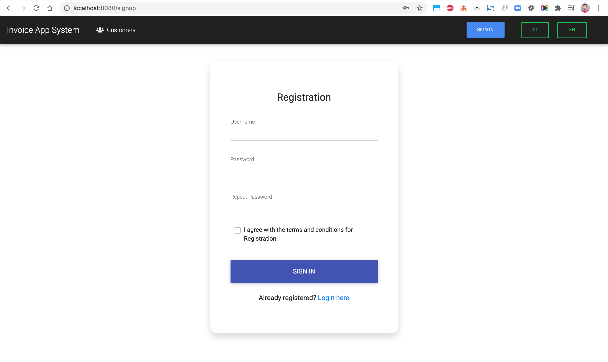
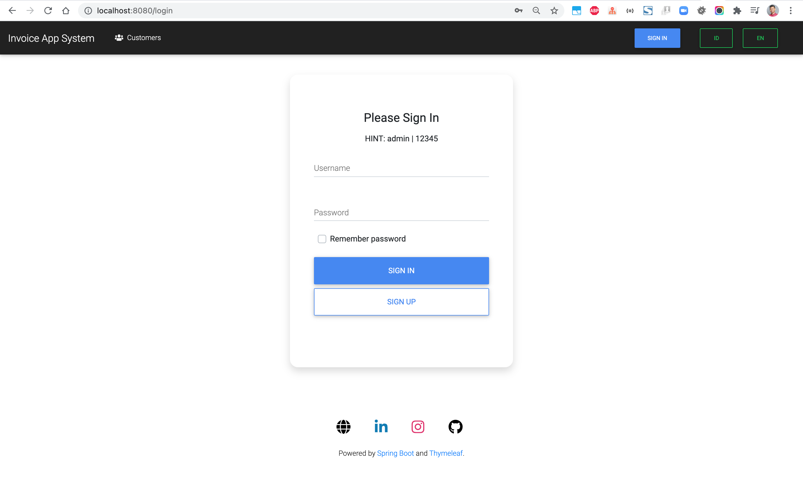
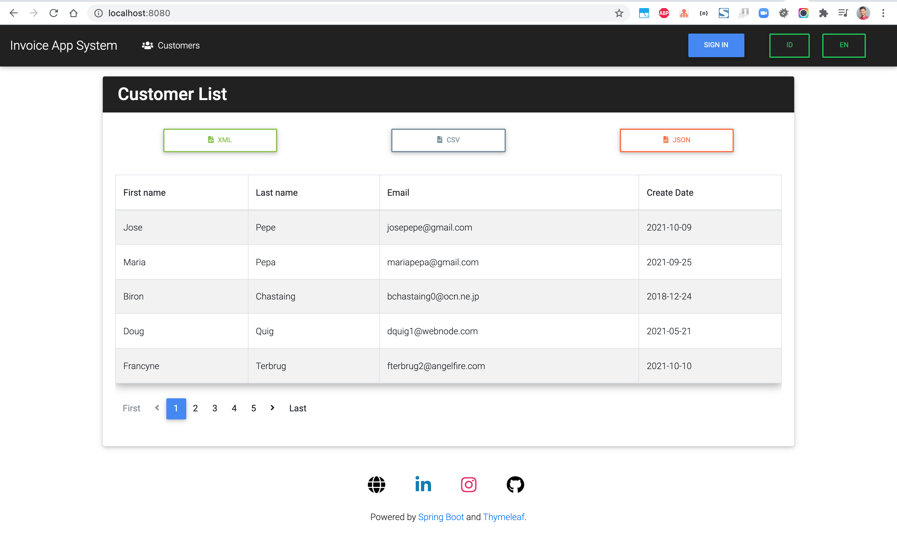
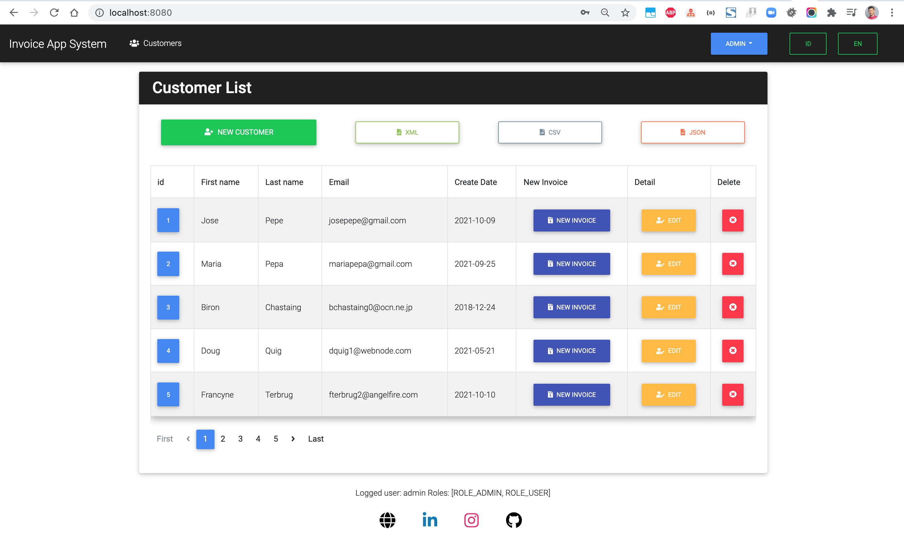
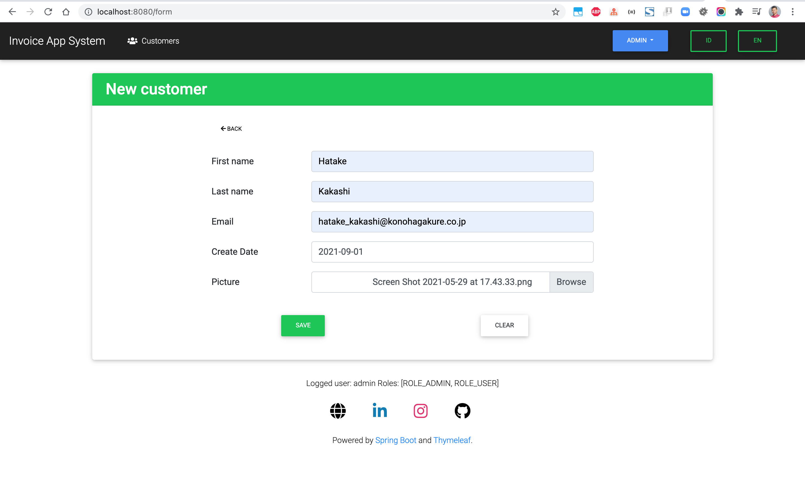
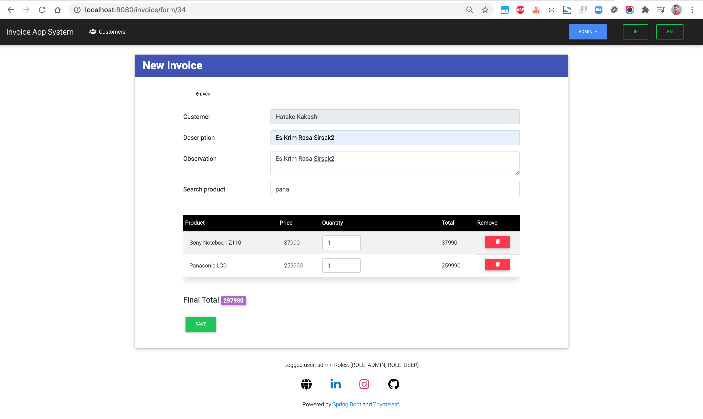
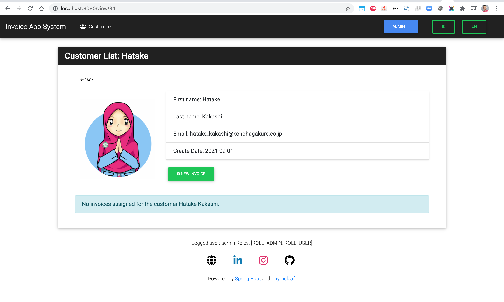
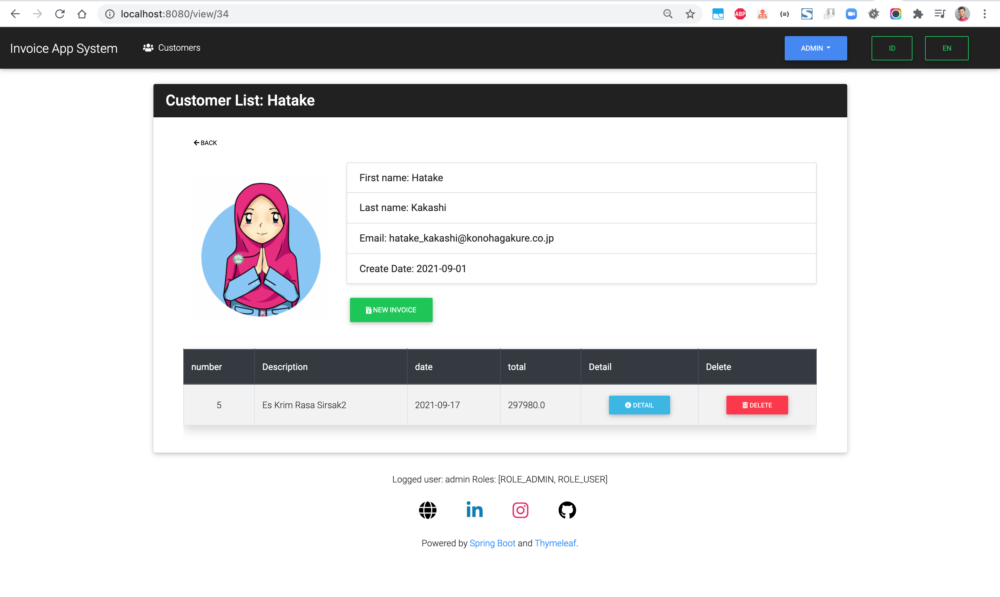
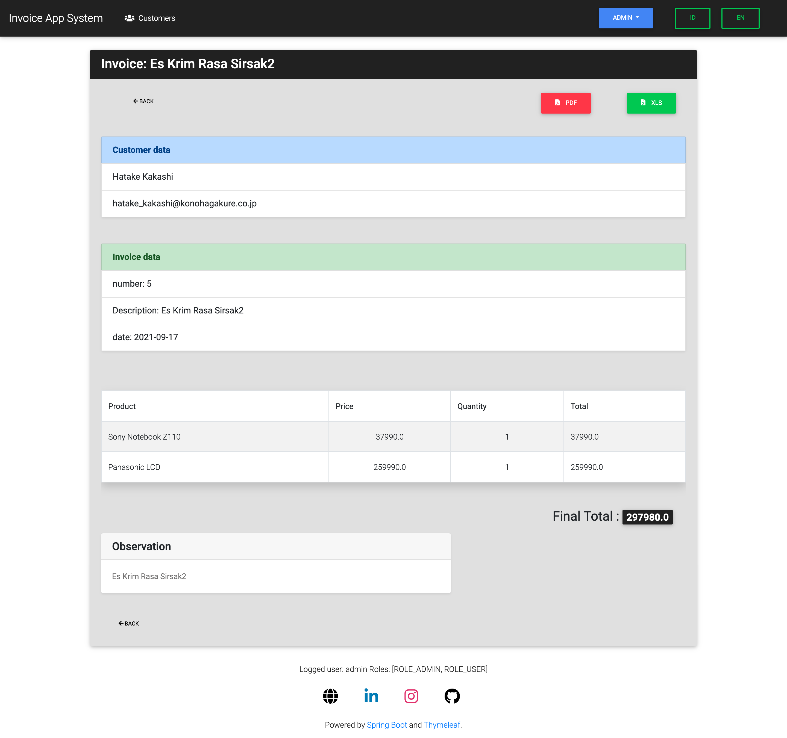
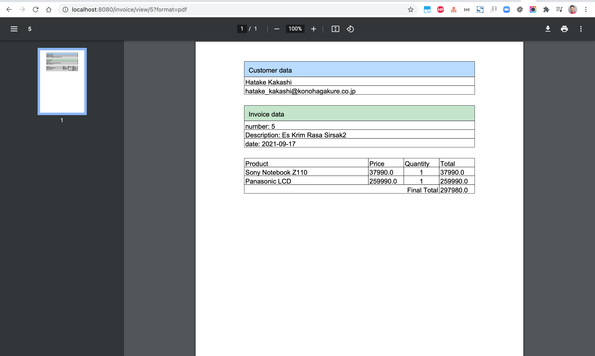

# 🌿 Peppermint

A modern, self-hosted helpdesk and ticket management system designed to simplify how teams handle support, issues, and internal workflows.

Built with a focus on **simplicity, performance, and flexibility**, Peppermint offers a clean alternative to bulky tools like Zendesk or Jira—without the overhead.


## ✨ Why Peppermint?

Managing support shouldn’t feel like managing another problem.

Peppermint helps teams:

* Organize customer and internal requests efficiently
* Keep track of conversations and history in one place
* Collaborate with clarity and minimal friction
* Deploy quickly with minimal setup


## 🚀 Features

* 🎫 **Ticket Management**

  * Create, track, and resolve issues with ease
  * Markdown support + file attachments

* 🧾 **Client History**

  * Maintain a complete log of interactions

* 📒 **Notes & Internal Docs**

  * Built-in markdown notebook with todo support

* 📱 **Responsive UI**

  * Works seamlessly across mobile, tablet, and desktop

* ⚙️ **Easy Deployment**

  * Docker-ready setup for quick self-hosting

* 🧩 **Extensible Design**

  * Built for customization and future expansion

## 🛠️ Tech Stack

* **Frontend:** React / Next.js
* **Backend:** Node.js
* **Database:** PostgreSQL
* **Deployment:** Docker / PM2
* **Language:** TypeScript


## 🐳 Quick Start (Docker)

```yaml
version: "3.1"

services:
  db:
    image: postgres:latest
    restart: always
    environment:
      POSTGRES_USER: peppermint
      POSTGRES_PASSWORD: 1234
      POSTGRES_DB: peppermint
    volumes:
      - pgdata:/var/lib/postgresql/data

  app:
    image: pepperlabs/peppermint:latest
    ports:
      - "3000:3000"
    depends_on:
      - db
    environment:
      DB_USERNAME: peppermint
      DB_PASSWORD: 1234
      DB_HOST: db
      SECRET: peppermint4life

volumes:
  pgdata:

Then open:

👉 `http://localhost:3000`

**Default login:**

```
admin@admin.com
1234

## 📦 Installation Options

* Docker (recommended)
* One-line installer (Linux)
* Manual setup for development


## 📖 Documentation

Detailed docs covering setup, usage, and development are coming soon.


## 💡 Use Cases

* Customer support systems
* Internal IT/helpdesk tools
* Startup ticket management
* Personal project tracking


## 🤝 Contributing

Contributions are welcome!

If you'd like to improve Peppermint:

1. Fork the repository
2. Create a feature branch
3. Submit a pull request


## 🧠 Philosophy

Peppermint started as a simple project to explore full-stack development—and evolved into something more practical.

The goal is simple:

> Build a powerful helpdesk system that stays lightweight and accessible.

## ⭐ Support

If you find this project useful, consider giving it a star ⭐
It helps the project grow and reach more developers.


## 📜 License

This project is open-source and available under the appropriate license.


## 🔮 Roadmap 

* Role-based access control improvements
* Better analytics dashboard
* Plugin ecosystem
* API enhancements

[1]: https://github.com/Peppermint-Lab/peppermint?utm_source=chatgpt.com "GitHub - Peppermint-Lab/peppermint: An open source issue management & help desk solution. A zendesk & jira alternative"


## Screen shot

User Registration



User Login



Index Page





New Customer



New Invoice



Customer Details





Customer Invoice



Invoice PDF



